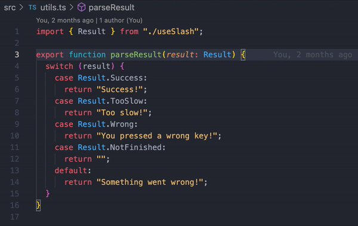

# simple-console-log

A simple VSCode extension to console log in place, adding detail about the current file, function, and line.

## Features

Inserts a console log statement with Ctrl + Alt + L  

## Extension Settings

<!-- Include if your extension adds any VS Code settings through the `contributes.configuration` extension point.

For example:

This extension contributes the following settings:

- `myExtension.enable`: enable/disable this extension
- `myExtension.thing`: set to `blah` to do something -->

None... yet.

## Release Notes

### 1.0.0

Version 1! The initial release
